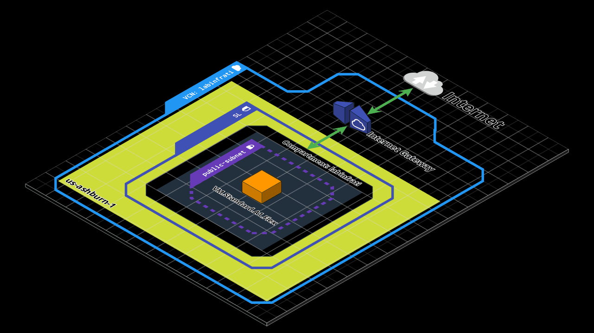

[](https://infrati.dev)

## OCI
##### Provisionado 2 x (VM.Standard.A1.Flex 2 OCPUs 12GB RAM) em subnet pública utilizando provisioners `file` e `remote-exec` para instalar um servidor web
##### Nesse exemplo utilizaremos o meta-argument `count` do terraform para criar as duas instâncias iguais.
##### Local state files

##### Estrutura provisionada



##### Requirements

* Terraform instalado, nesse caso utilizado v1.2.6
* Credenciais de acesso já criadas no OCI com as permissões necessárias para acesso ao compartimento.
* Private key gerada.

Estrutura **terraform.tfvars** necessária

```
# Refer to the README.md file to fill these in
tenancy_ocid     = ""
user_ocid        = ""
private_key_path = ""
fingerprint      = ""
region           = "us-ashburn-1"
compartment_ocid = ""

# Choose your VM images here
vm_image_ocid_ampere = "ocid1.image.oc1.iad.aaaaaaaax7auywhy24b27lsebtyzuhu6rqvu5uspvdretsdbtuovoely4iha"

# Add your SSH key here
ssh_public_key = ""

# Optional: Replace this with your preferred environment name
compartment_name = "labinfrati"
vm_name          = "labinfrati"
tags             = { Project = "labinfrati" }
```

##### Arquivos terraform (Terraform irá processar todos os arquivos .tf)

##### Inicializando o diretório, baixando e instalando o provider da oci
`terraform init`
*Terraform has been successfully initialized!*

##### Acertar identação do terraform
`terraform fmt`

##### Validando configuração
`terraform validate`

##### Plano de configuração
`terraform plan`

##### Aplicando plano
`terraform apply`

<br>

[](https://infrati.dev)


