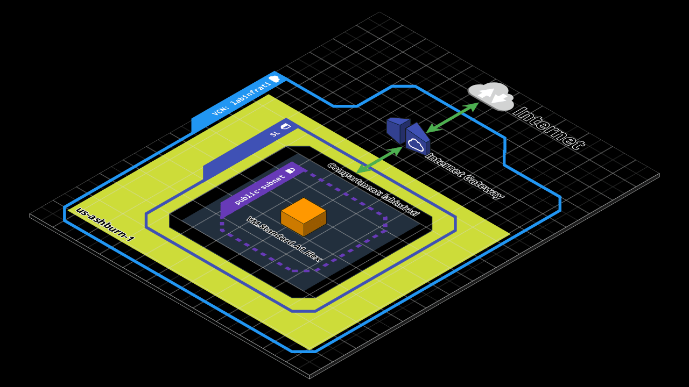
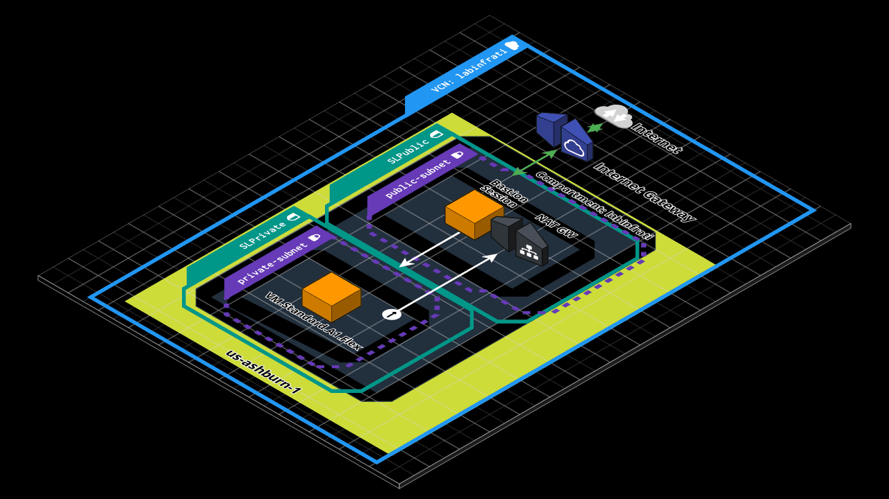

### Usando terraform OCI

### Contents 
  - [01-1xStdA1Flex-CloudInit](01-1xStdA1Flex-CloudInit/)
  - [02-2xStdA1Flex-CloudInit](02-2xStdA1Flex-CloudInit/)
  - [03-1xStdA1Flex-CloudInit-Bastion](03-1xStdA1Flex-CloudInit-Bastion/)
  - [04-2xStdA1Flex-CloudInit-Bastion](04-2xStdA1Flex-CloudInit-Bastion/)
  - [05-2xStdA1Flex-CloudInit-Bastion-ALB](05-2xStdA1Flex-CloudInit-Bastion-ALB/)

 

<table>
  <tr>
     <td style="text-align: center; vertical-align: middle;"><a href="01-1xStdA1Flex-CloudInit/">01-1xStdA1Flex-CloudInit</a></td>
    <td style="text-align: center; vertical-align: middle;"><a href="02-2xStdA1Flex-CloudInit/">02-2xStdA1Flex-CloudInit</a></td>
  </tr>
  <tr>
    <td style="text-align: center; vertical-align: middle;"></td>
    <td style="text-align: center; vertical-align: middle;"></td>
  </tr>
  <tr>
    <td style="text-align: center; vertical-align: middle;"><a href="03-1xStdA1Flex-CloudInit-Bastion/">03-1xStdA1Flex-CloudInit-Bastion</a></td>
    <td style="text-align: center; vertical-align: middle;"><a href="04-2xStdA1Flex-CloudInit-Bastion/">04-2xStdA1Flex-CloudInit-Bastion</a></td>
  </tr>
  <tr>
    <td style="text-align: center; vertical-align: middle;"></td>
    <td style="text-align: center; vertical-align: middle;"></td>
  </tr>
    <tr>
    <td style="text-align: center; vertical-align: middle;"><a href="05-2xStdA1Flex-CloudInit-Bastion-ALB/">05-2xStdA1Flex-CloudInit-Bastion-ALB</a></td>
    <td style="text-align: center; vertical-align: middle;"></td>
  </tr>
  <tr>
    <td style="text-align: center; vertical-align: middle;"></td>
    <td style="text-align: center; vertical-align: middle;"></td>
  </tr>
 </table>

 

